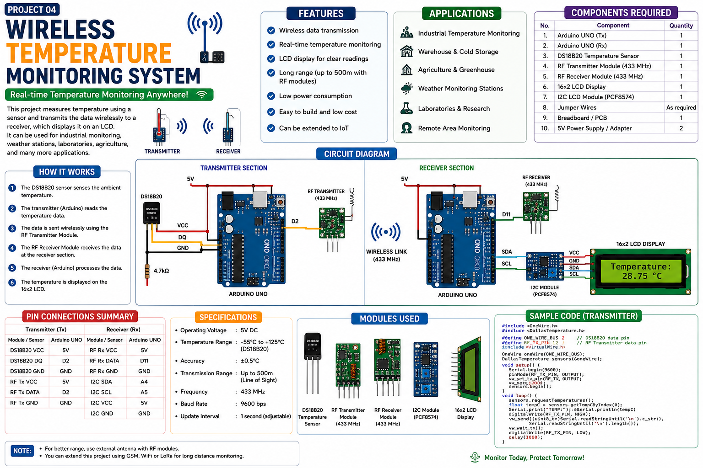

  

# Wireless Temperature Monitoring System using Arduino, DS18B20, 433 MHz RF, and I2C LCD

This project builds a practical wireless temperature monitoring system using two Arduino UNO boards. One Arduino reads temperature from a DS18B20 sensor and sends it wirelessly through a 433 MHz RF transmitter, while the second Arduino receives the data and shows the live temperature on a 16x2 I2C LCD.

## Project overview

The system is divided into two sections:

- **Transmitter unit:** Arduino UNO + DS18B20 + 433 MHz RF transmitter.
- **Receiver unit:** Arduino UNO + 433 MHz RF receiver + 16x2 LCD with I2C module.

The DS18B20 sensor works with the OneWire and DallasTemperature libraries in Arduino projects.[cite:6][cite:9][cite:12]
The 433 MHz RF modules can be used with the VirtualWire library, and the data pin can be connected to an Arduino digital pin.[cite:1][cite:5][cite:11]
A common 16x2 I2C LCD on Arduino UNO typically uses SDA on A4 and SCL on A5.[cite:7][cite:10]

## Components required

| Component | Quantity | Purpose |
|---|---:|---|
| Arduino UNO | 2 | One for transmitter, one for receiver |
| DS18B20 temperature sensor | 1 | Measures temperature |
| 4.7 kOhm resistor | 1 | Pull-up resistor for DS18B20 data line |
| 433 MHz RF transmitter module | 1 | Sends temperature data wirelessly |
| 433 MHz RF receiver module | 1 | Receives transmitted data |
| 16x2 LCD with I2C backpack | 1 | Displays received temperature |
| Breadboard | 2 | Circuit prototyping |
| Jumper wires | As needed | Electrical connections |
| USB cable / 5V supply | 2 | Power for both Arduinos |

## Required libraries

Install these libraries from the Arduino IDE Library Manager before uploading the code:

- **OneWire**
- **DallasTemperature** for DS18B20 support.[cite:6][cite:9][cite:12]
- **VirtualWire** for 433 MHz RF communication.[cite:1][cite:5][cite:11]
- **Wire** for I2C communication with the LCD.
- **LiquidCrystal_I2C** for the 16x2 I2C LCD.[cite:7][cite:10]

## Circuit connections

### Transmitter wiring

| Arduino UNO pin | Connected to | Notes |
|---|---|---|
| 5V | DS18B20 VCC | Sensor power |
| GND | DS18B20 GND | Common ground |
| D2 | DS18B20 DATA | OneWire data pin |
| 5V | 433 MHz TX VCC | RF transmitter power |
| GND | 433 MHz TX GND | RF transmitter ground |
| D12 | 433 MHz TX DATA | RF transmit data pin |
| D13 | Onboard LED | Status blink during transmission |

**Important:** Connect a 4.7 kOhm resistor between DS18B20 DATA and 5V as a pull-up resistor. The DS18B20 requires OneWire communication support and is commonly used this way in Arduino examples.[cite:6][cite:9]

### Receiver wiring

| Arduino UNO pin | Connected to | Notes |
|---|---|---|
| 5V | 433 MHz RX VCC | RF receiver power |
| GND | 433 MHz RX GND | RF receiver ground |
| D11 | 433 MHz RX DATA | RF receive data pin |
| 5V | LCD VCC | LCD power |
| GND | LCD GND | LCD ground |
| A4 | LCD SDA | I2C data line on UNO.[cite:7][cite:10] |
| A5 | LCD SCL | I2C clock line on UNO.[cite:7][cite:10] |
| D13 | Onboard LED | Status blink on packet receive |

## How the system works

1. The DS18B20 sensor measures temperature and sends the reading to the transmitter Arduino using the OneWire protocol.[cite:6][cite:9]
2. The transmitter Arduino converts the temperature value into text format and sends it through the 433 MHz RF transmitter using VirtualWire.[cite:1][cite:5][cite:11]
3. The RF receiver module captures the wireless data and passes it to the receiver Arduino through a digital input pin.[cite:1][cite:11]
4. The receiver Arduino decodes the received text and displays it on the 16x2 I2C LCD.[cite:7][cite:10]
5. The loop repeats continuously, so the displayed temperature keeps updating in real time.

## Arduino code structure

### Transmitter code features

- Reads temperature from DS18B20 every 1 second.
- Detects sensor disconnection and sends `ERR` if the sensor fails.
- Sends temperature as ASCII text over 433 MHz RF.
- Toggles the onboard LED on every successful transmission.

### Receiver code features

- Listens continuously for incoming RF packets.
- Shows `Waiting...` during startup.
- Displays temperature in Celsius on the LCD when data arrives.
- Shows `Sensor Error` if transmitter reports a fault.
- Shows `No Signal` if no packet is received for 3 seconds.

## File list

- `transmitter.ino` — code for the temperature sensing and RF transmission unit.
- `receiver.ino` — code for the RF receiving and LCD display unit.

## Upload steps

1. Open `transmitter.ino` in Arduino IDE and select **Arduino UNO** board.
2. Install all required libraries.
3. Upload transmitter code to the first Arduino UNO.
4. Open `receiver.ino` and upload it to the second Arduino UNO.
5. Power both boards.
6. Adjust the LCD I2C address if your display does not use `0x27`; many modules use `0x27` or `0x3F`.[cite:7][cite:10]

## Troubleshooting

### 1. LCD shows nothing

- Check LCD power and GND.
- Verify SDA is connected to A4 and SCL to A5 on Arduino UNO.[cite:7][cite:10]
- Confirm the I2C address; scan for `0x27` or `0x3F` if needed.
- Make sure the contrast potentiometer on the LCD backpack is adjusted correctly.

### 2. Receiver shows `No Signal`

- Check RF module wiring carefully.
- Confirm transmitter DATA pin matches `vw_set_tx_pin()` and receiver DATA pin matches `vw_set_rx_pin()`.
- Verify both sketches use the same VirtualWire bit rate, here `2000` bps.[cite:5]
- Keep both modules powered properly; some hobby examples note shared ground and stable supply are important for reliable operation.[cite:1]

### 3. Temperature shows `Sensor Error`

- Check the DS18B20 pin order.
- Verify the 4.7 kOhm pull-up resistor between DATA and 5V.
- Make sure the sensor data wire is connected to pin D2 in the sketch.
- Recheck OneWire and DallasTemperature library installation.[cite:6][cite:9][cite:12]

### 4. Code compilation errors

- Install missing libraries from **Sketch > Include Library > Manage Libraries**.
- Make sure the included library names match the code exactly.
- If `LiquidCrystal_I2C.h` is missing, install a compatible LiquidCrystal_I2C library.[cite:10][cite:13]

## Practical notes

- These simple 433 MHz RF modules are low-cost and easy to use, but they are not highly robust in noisy environments.[cite:11]
- Keep antenna wires attached for better range.
- Avoid placing the RF modules too close to switching power supplies.
- Start by testing the DS18B20 and LCD separately before combining the full system.

## Future improvements

- Add checksum or packet framing for stronger communication reliability.
- Send both Celsius and Fahrenheit values.
- Add min/max temperature logging.
- Use an ESP32 receiver and upload readings to Wi-Fi or cloud dashboards.
- Replace 433 MHz ASK modules with LoRa for longer range and better reliability.
- Add buzzer or relay output for over-temperature alarm.
- Add battery supply and low-power mode for remote sensing nodes.

## Resume description

**Wireless Temperature Monitoring System using Arduino and RF Communication**  
Designed and developed a wireless temperature monitoring system using two Arduino UNO boards, a DS18B20 digital temperature sensor, 433 MHz RF transmitter/receiver modules, and a 16x2 I2C LCD. Implemented real-time wireless data transmission, live temperature display, sensor fault handling, and signal-loss indication using Embedded C / Arduino programming.

## one line project summary

Built a real-time wireless temperature monitoring system using Arduino UNO, DS18B20 sensor, RF modules, and I2C LCD for wireless data transmission and live temperature display.
